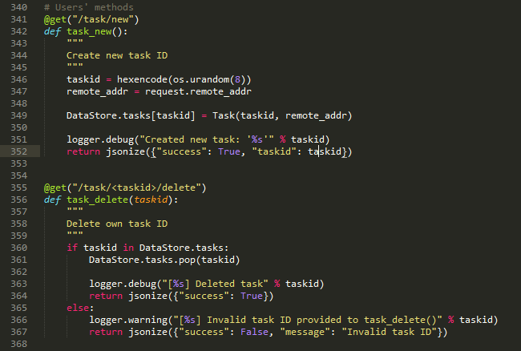
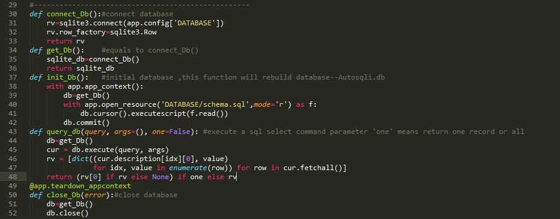

装了这么多天13终于可以开心的写中文的文档了，恰逢寒假，也有时间好好理理在这个应用开发过程中的经验教训。当然这个应用在各位大神看来或许并不值得一看，但是希望能给和我一样的菜鸟在遇到这样的课题时能有所帮助，少走弯路，毕竟在网上能找到的关于sqlmapapi的资料少之又少。
##Sqlmap项目

> Sqlmap是一款开源的自动探测和发现sql注入漏洞以及拿下数据库服务器的工具，它有一个强大的探测引擎, SqlMap是一个开放源码的渗透测试工具，它可以自动探测和利用SQL注入漏洞来接管数据库服务器。它配备了一个强大的探测引擎，为最终渗透测试人员提供很多功能，可以拖库，可以访问底层的文件系统，还可以通过带外连接执行操作系统上的命令。

简单的说Sqlmap就是一个用来进行SQL注入的自动化工具。这个工具十分强大，它的具体使用方法可以搜一下“sqlmap用户手册”之类的东西。但是主要难点在于理解sql注入的基本原理和高级手段，很遗憾我并不能完全理解。
##SqlmapApi
随着sqlmap在sql注入上的广泛使用，sqlmap本身的缺陷也逐渐暴露出来，最重要的一个就是任务管理太麻烦。在控制台下，管理本身就是一个很不方便的事情，虽然sqlmap有自己的任务队列机制，但是大家脑补一下就能知道这个东西并不是很靠谱。各种各样的原因使得sqlmap的团队开发除了sqlmapapi这个东西。sqlmapapi类似于一个server、client程序，写过简单tcp程序的同学都应该能够理解这种工作方式，唯一不同的是sqlmapapi使用了http协议中的get和post两种数据请求方式来实现交互。具体sqlmapapi怎么使用后面再讲。
##Autosqli
Autosqli也就是我所做的这个东西，起因是我们有一门信息安全实践课程，我选课题的时候选了这个。Autosqli就是利用sqlmapapi去做一些扩展。课题最初的要求是这样的：
1. 利用sqlmapapi.py实现任务池，同时检测多个任务。
2. 完成url去重，判断该url是否在任务池中或已完成。
3. 实现任务调度，能够并发检测多个任务。
4. 加入分布式方法。
5. 方便快捷的添加任务功能。
6. 开放http代理
7. web管理界面
8. 其他功能性扩展

##如何使用sqlmapapi
1. 操作系统：Linux (Ubuntu15.10)
2. 编译环境：python 2.7
3. 权限：管理员权限
4. 下载sqlmap项目【注意：在SourceForge上的sqlmap项目下载完后没有sqlmapapi.py这个文件，请在github上[下载](https://github.com/sqlmapproject/sqlmap)】
5. 解压下载好的压缩文件，并将sqlmap-master文件夹放到/usr/lib/python2.7/下
6. 打开一个终端，输入`cd /usr/lib/python2.7/sqlmap-master` `sudo python sqlmapapi -s`，这就是sqlmapapi的服务器端

7. 再打开一个终端，输入`cd /usr/lib/python2.7/sqlmap-master` `sudo python sqlmapapi -c` ，这就是sqlmapapi的客户端
8. 现在，你可以在客户端的终端上建立sql注入任务了，具体方法--help

##利用sqlmapapi进行扩展的原理
前面说过，sqlmapapi的服务器端会接收来自客户端的get和post请求，你在sqlmapapi.py -c的终端上所做的事情其实都是以http请求的方式发送给sqlmapapi.py -s的终端上的。我们要做的就是使用web应用程序替代sqlmapapi.py -c。
打开sqlmap-master\lib\utils文件夹中的api.py文件。在这个python文档中可以看到sqlmapapi的服务端可以接收的所有请求。

这幅图中包含了两个函数，一般情况下sqlmapapi.py -s会运行在127.0.0.1:8775这个地址上，如果我们在浏览器中访问127.0.0.1:8775/task/new这个网址的话，可以看到浏览器中出现了一个json的数据包，其中包含了'taskid'和'success'两个项目。这就是图中341行的task_new函数的功能。总结起来，sqlmapapi一共提供了以下几个函数供我们使用：
####用户方法
1. @get("/task/new")
2. @get("/task//delete")
####管理函数
1. @get("/admin//list")
2. @get("/admin//flush")
####核心交互函数
1. @get("/option//list")
2. @post("/option//get")
3. @post("/option//set")
4. @post("/scan//start")
5. @get("/scan//stop")
6. @get("/scan//kill")
7. @get("/scan//status")
8. @get("/scan//data")
9. @get("/scan//log//")
10. @get("/scan//log")
11. @get("/download///")
我们将在Autosqli中使用python的requests模块对sqlmapapi服务器进行访问，当然还可以使用urllib2，但是requests更加方便。

##让我们跑起来！
先不要在乎Autosqli的具体代码，跑起来再说
1. 在github上下载Autosqli的源代码【[下载地址](https://github.com/LeeHDsniper/AutoSqli)】，或者`git clone git@github.com:LeeHDsniper/AutoSqli.git`
2. 安装Flask【[如何安装？](http://dormousehole.readthedocs.org/en/latest/installation.html)】，如果你使用的是linux，并且安装好了python的pip的话，直接在终端中输入`sudo pip install flask`就ok。
3. 运行sqlmapapi的服务器端，最好让它运行在0.0.0.0上，默认的127.0.0.1是本地环回测试地址，如果要使用分布式*（后面介绍）*的话只能使用0.0.0.0。具体命令是这样：`cd /usr/lib/python 2.7/sqlmap-master` `sudo python sqlmapapi.py -s -H 0.0.0.0` 
4. 运行Autosqli `sudo python Autosqli/Autosqli.py`
5. 在浏览器中输入127.0.0.1，ok，你就可以看到Autosqli的界面了。
6. 如果你想看看具体的测试实例，可以访问这个项目的github【[地址](https://github.com/LeeHDsniper/AutoSqli)】，其中有一个ppt文件，在这个文件的最后有测试实例。
##几个重要的功能
1. 数据库
其实一开始对使用哪种数据库让我很纠结，按照我以往的习惯肯定习惯于MySQL，但是为了让服务器搭建起来更加容易，我放弃了数据库的性能，选用了SQLite。整个库中只包含一个表，这个表中存储了任务的所有者，taskid，任务参数，日志，结果等信息。这几个函数包含了基本的数据库操作：

另外我又封装了几个函数，用来分别写入日志、扫描结果等。
2. URL去重
其实把它叫做任务去重更加合适，功能很简单，根据用户已建立的任务参数和要建立任务的参数匹配，得出是否重复的判断结果，如果已经建立，那么服务器会拒绝这次任务请求。

其实这项功能的主要作用应该是检测数据库中所有用户建立的任务，如果该用户没有建立过但是已经有其他用户建立过，直接返回这条数据以减少服务器压力。
3. 分布式与负载均衡
前面提到过分布式计算，目前的实现方式是多台运行了sqlmapapi的服务器同时运行，由一个简单的判断程序将任务进行分配。详细的解释可以看github中的那个ppt。但是按照我的理解，这不能算作完全意义上的分布式计算，或者说真正意义上的分布式应当可以进一步细化，而不是以一个任务为基本单位进行分配，可以以一个payload为基本单位。其次就是负载均衡，简单讲应该以服务器的资源占有率进行分配，但是目前只是进行简单的计数，哪台服务器上运行的任务少就分配到哪台。
4. 任务调度
如果要实现任务调度，那就需要对用户可以同时进行的任务数目进行限制，比如限制在5个，那么用户在建立时可以选择一个任务的优先级进行操作。不然的话任务调度是没有意义的。因此，我只做了开始、停止、删除这三项功能。
5. 自定义任务的参数
sqlmapapi拥有一百多个任务参数，具体可以参考github上的set_options.txt。由于这一百多个参数过于复杂和庞大，我在自定义任务页面只做了可以满足基本测试的几个。
6. 不得不提的注入结果展示界面
sqlmapapi的所有返回数据都是json数据包，如果数据量不多还好，一旦json数据包的结构更加复杂，项目更加多的话，它在用户界面的展示就会成为一个极为棘手的问题。就在我苦战多天准备放弃的时候，一个想法突然出现了，虽然不是很光彩，但是确实解决了这个问题。至于如何解决的，请在github中的英文readme.md中的最后找。
##结语
sqlmap真的是一个非常强大的注入工具，而对它进行可视化其实有两条路线，一种是使用普通的应用程序，另一种是使用web应用。相比之下，web应用对于客户端来说更加方便，也没有系统环境限制，例如 Nessus那样。
Autosqli这个项目其实很简单，只不过是作为一个简单的python在web应用方面的尝试，并没有对sql注入以及sqlmap本身进行研究，但是它有很多的扩展潜力，比如更加自动化的注入【可能需要改写sqlmap的源代码】，对于WAF的检测和绕过等方面比起前端来说更加吸引人。
如果有能力的大神能够进行深层次的扩展，欢迎指导~
