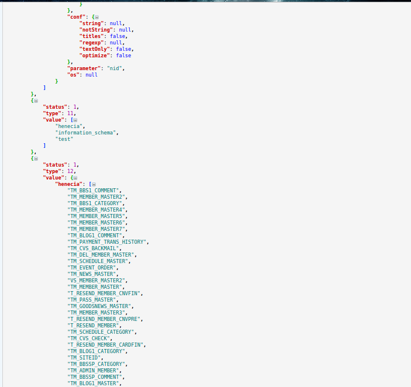

#AutoSqli

##What is sqlmap
> Sqlmap is an open source penetration testing tool that automates the process of detecting and exploiting SQL injection flaws and taking over of database servers. It comes with a powerful detection engine, many niche features for the ultimate penetration tester and a broad range of switches lasting from database fingerprinting, over data fetching from the database, to accessing the underlying file system and executing commands on the operating system via out-of-band connections.
   
   >[**get more infomation at www.sqlmap.org**](www.sqlmap.org)

##What is sqlmapapi
> Sqlmap is a excelente SQL injection and exploit tool,but our work is still inefficient.Each URL needs to be tested manual.The author of Sqlmap realized this problem and writed sqlmapapi to fix this.Only after using sqlmapapi to detect SQL injection flaws,you can feel how powerful the sqlmap is.
   
   >[**you can download sqlmap and sqlmapapi at github project**](https://github.com/sqlmapproject/sqlmap)
   
##What is AutoSqli
> AutoSqli is a web application that provide a hommization UI of sqlmap.It has easy methods to building a SQL detection and managing test missons.You don't have to open two terminals as server and client,and type many commands like [*use <task id\>*],[*status*] or [*data*] and so on.

> **AutoSqli has four fundamental pages**

* ####QuickBuild
> This page provide the most basic function:*check a URL that has some parameters like [www.example.com/index.php?id=2] wether has SQL flaws.*That means all parameters of sqlmap **except 'url'** will be false or null.

* ####CustomTask
> This page is the core of this application.You can select many parameters and fill in cookies of url you want to test.

* ####TaskList
> You can view and manage all task you have built in this application.It will refresh automatically every 1 second.Each task has a status.When status is *terminated*,the detect is done.You can click log and data to view scan log and result,of course you can delete this task.

* ####Instruction
> This page introducts functions of all sqlmapapi's parameters.

##Something needs to be improved eagerly

* ####More perfect way to exhibit result of scan
> I have tried many ways to convert json data of result to html table,but when I add two or more parameters to scan,the json data returned by sqlmapapi is so complicated that it is hard to convert.***This is a json data of a detect with one parameter***

> When I convert this to a html table,the result is acceptable barely.***But when parameter is two:***

> It is so complicated that I have to use these code to convert it:
> ***...snip...line 82***

        for data_item in response_data:
            if type(data_item['value'])==list:
                data_html=data_html+self.list_2_html(data_item['value'])
            elif type(data_item['value'])==dict:
                data_html=data_html+self.dict_2_html(data_item['value'])
            else:
                data_html=data_html+self.str_2_html(data_item['value'])
        data_html=re.sub("u'","",data_html)
        self.taskid_data_Dict[taskid]=data_html
> ***...snip...line 92***

        def list_2_html(self,data_list):
            data_html='<table border="1">'
            for i in range(0,len(data_list)):
                if type(data_list[i])==dict:
                    for item in data_list[i]:
                        data_html=data_html+'<tr><td class="item">'+str(item)+'</td><td>'+str(data_list[i][item])+'</td></tr>'
                else: 
                    data_html=data_html+'<tr><td class="item">'+str(i)+'</td><td>'+data_list[i]+'</td></tr>'  
        data_html=data_html+"</table>"
            return data_html
        
        def dict_2_html(self,data_dict):
            data_html='<table  border="1">'
            for key in data_dict:
                data_html=data_html+'<tr><td class="item">'+str(key)+'</td><td>'+str(data_dict[key])+'</td></tr>'
            data_html=data_html+"</table>"
            return data_html
        
        def str_2_html(self,data_unknown):
            data_html='<table  border="1"><tr><td class="item">'+str(data_unknown)+'</td></tr></table>'
            return data_html
> ***...snip...line 111***

> How to convert scan result to a perfect exhibition is the most important problem I have.
